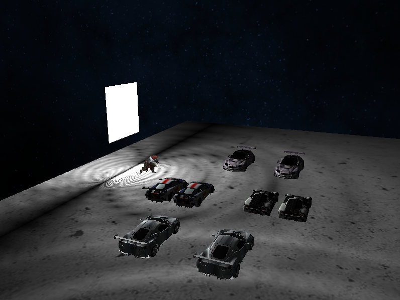

## GPU프로그래밍 프로젝트
### OpenGL을 사용하여 자동차 전시장 구현
---
### 사용 기술

- Assimp 라이브러리로 Model Loading

- Skeletal Animation 구현
 
[Skeletal Animation by LearnOpenGL](https://learnopengl.com/Guest-Articles/2022/Area-Lights)
 
- Area Light 구현
[Area Light by LearnOpenGL](https://learnopengl.com/Guest-Articles/2022/Area-Lights)

- Light의 위치와 세기에 따른 물체들이 받는 빛 조절
- 밤하늘 Skybox 사용

### 최종 이미지

  
